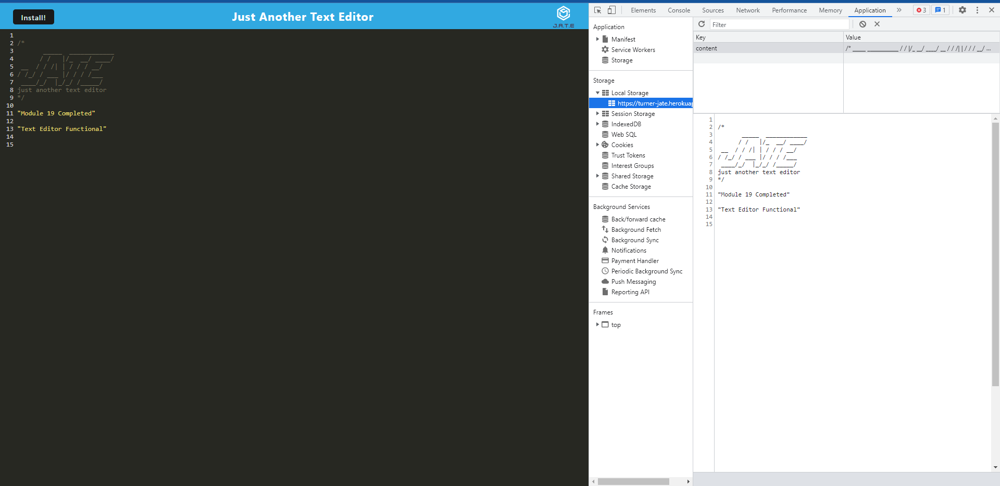
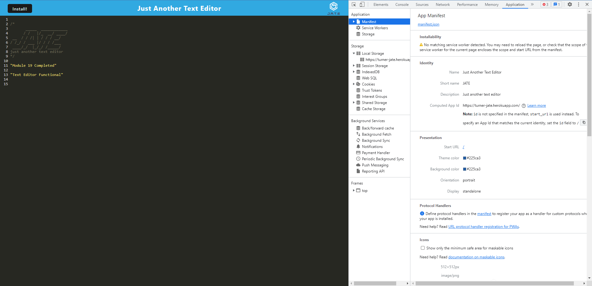

# Progressive Web Application - Text Editor

## Description
This text editor web application allows the user to create notes or code snippets with or without an internet connection and saves them for later use.

## Link to Deployed Application on Heroku

<a href="https://turner-jate.herokuapp.com/">PWA JATE on Heroku</a> 

## Table of Contents
* [Installation](#installation)
* [Usage](#usage)
* [License](#license)
* [Questions](#questions)

## Images depicting functionality 

## Installation
For a local install, run npm install, then npm run start to open the text editor in your browser.
## Usage
Enter your desired notes on the text editor and they are saved to the database in real time by the application.
## License
This project is licensed under the <a href="https://opensource.org/licenses/MIT">MIT</a> license.

## Questions
For questions about this repo, application, or to provide feedback please contact me at mark.edward.turner@gmail.com

My GitHub repo can be found at [GitHub](https://github.com/TboneXX)
